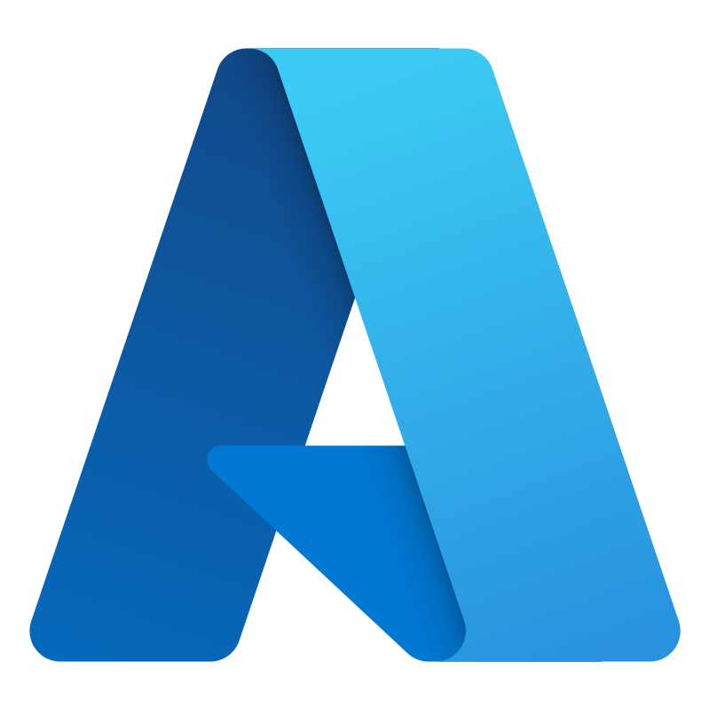
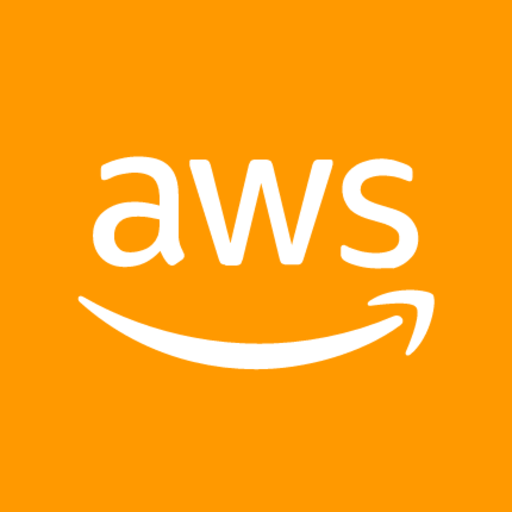

# Hi! I'm Mayur👋

### I study Artificial Intelligence at the University of North Texas. 📚

### I'm passionate about applying the intersection of Machine Learning and Software Engineering to create societal impact 🤖

 

## Technologies/Languages 📑

 

 

     

## Hackathons 🏆

- _Best use of DigitalOcean_ - FreyHacks 2022: "[SumFun](https://devpost.com/software/sumfun)"
- _Participant_ - Hack The North 2021: "[Tax Auto](https://devpost.com/software/tax-auto)"

 

## Other Interests ✌️

- Math nerd ➗
- EDM Fanatic 🎶
- Machine Learning Researcher 📈    

 

## Socials 📫

- [LinkedIn](https://www.linkedin.com/in/mayur-vora-/)
- [Instagram](https://www.instagram.com/mayur.voraa/)
